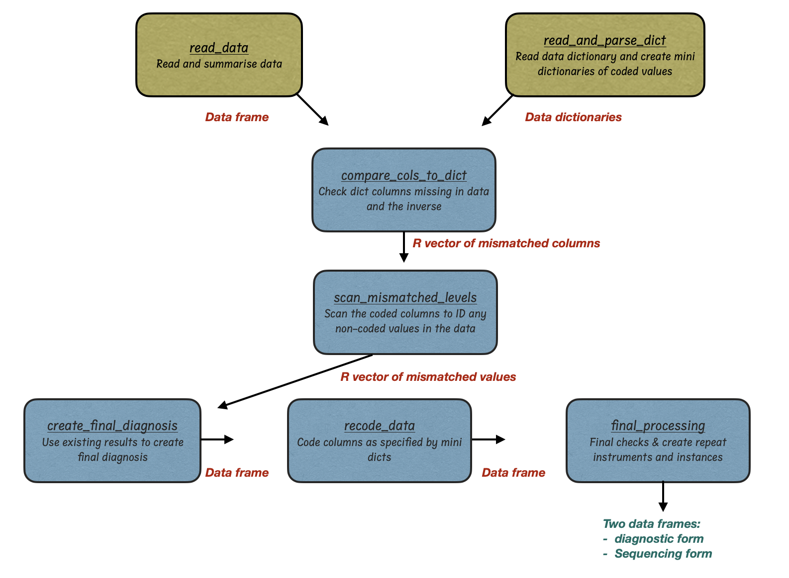

# rabvRedcapProcessing

**Tools for processing rabies metadata for REDCap upload**

<!-- badges: start -->
[](https://RAGE-toolkit.github.io/rabvRedcapProcessing/)
<!-- badges: end -->

---

## Table of Contents

1. [Introduction](#introduction)
2. [Workflow](#workflow)
3. [Installation](#installation)
4. [Bug Reports](#bug-reports)
5. [Contributors](#contributors)

---

## Introduction

`rabvRedcapProcessing` is an R package designed to streamline the cleaning, validation, and formatting of rabies lab metadata before uploading to REDCap. It automates common curation tasks including:

- Matching data to a REDCap dictionary
- Handling common mismatches and blank fields
- Recoding labels to dictionary codes
- Creating REDCap-compatible repeat instruments (diagnostic and sequencing forms)

This ensures data consistency across multiple labs and minimizes manual formatting errors.

---

## Workflow

The typical workflow is illustrated below:



| Function                      | Description                                              | Input            | Output                               |
|-------------------------------|----------------------------------------------------------|------------------|--------------------------------------|
| `read_data()`                 | Load and summarize input metadata                        | csv filePath     | Data frame + duplicates report       |
| `read_and_parse_dict()`       | Load REDCap dictionary and extract coded lists           | optional dictPath| List of mini dictionaries     |
| `compare_cols_to_dict()`      | Check for missing or extra columns vs REDCap dictionary  | Data + optionaldictPath| Harmonized data frame  |
| `scan_mismatched_levels()`    | Scan for values that don't match allowed dictionary codes| Data + col_to_check + dicts | Warnings to inform your manual processing (if necessary) |
| `tidy_up_values()`            | Fix common value mismatches (e.g., typos, synonyms)      | Data             | Cleaned data                   |
| `create_diagnostic_result_rule()` | Derive final diagnostic result from test columns     | Data             | updated `diagnostic_result`(df)|
| `recode_data()`               | Recode labels to dictionary codes                        | Data + dicts     | Recoded data frame             |
| `final_processing()`          | Final formatting & generation of REDCap-ready forms      | Data + optionaldictPath +  access_group | Diagnostic + Sequencing forms  |

---

## Installation

Install directly from GitHub using `devtools`:

```r
# install.packages("devtools") # if not already installed
devtools::install_github("RAGE-toolkit/rabvRedcapProcessing")
library(rabvRedcapProcessing)

```

## Bug reports

Please report issues or suggest improvements via GitHub:


```r

URL: https://github.com/RAGE-toolkit/rabvRedcapProcessing
BugReports: https://github.com/RAGE-toolkit/rabvRedcapProcessing/issues

```


### Contributors

Martha M. Luka, Kirstyn Brunker

