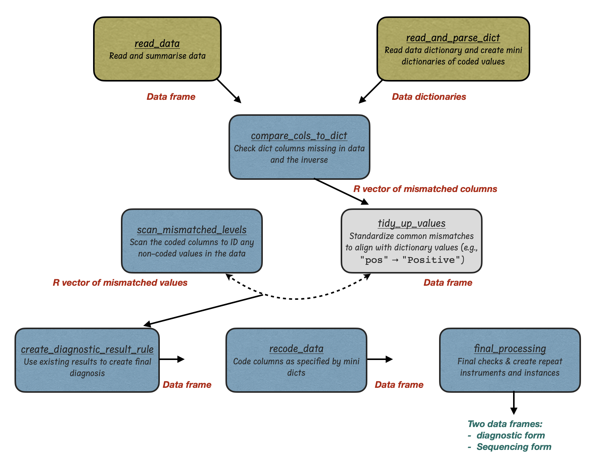

# rabv_redcap_processing
R package to process metadata for upload to redcap


<!-- badges: start -->
<!-- badges: end -->


## Table of Contents

1. [Introduction](#Introduction)
2. [Workflow](#Workflow)
3. [Installation](#contributors)


## Introduction

This R package is a collection of scripts to automate the cleaning and processing of rabies genetic data and metadata before auploading to RedCap. 

## Workflow



**redcapProcessing workflow**. 

| Function                   | Description                                          | Input        | Output       |
|----------------------------|------------------------------------------------------|--------------|--------------|
| `read_data()`   | Read and summarise the data  | CSV file   | CSV          |
| `process_data()` | Create a final diagnosis   | R object | R object      |
| `read_and_parse_dict()` | Read dict and create mini dicts of coded values   | filePath | R object    |
| `compare_cols_to_dict()` | Compare columns in data vs dictionary        | R object    | R object        |
| `scan_mismatched_levels()` | Scan the coded columns to ID any non-coded values in the data  | R object    | R object    |
| `recode_data()` | Code columns as specified by mini dicts   | R object  | R object       |
| `final_processing()` | Create repeat instances; ensure dict cols in are in data      | R object    | R object   |
| `express_process()` | Skip all the mini steps & get your data upload ready | CSV file   | R vector     |


## Installation

The `rabv_redcap_processing` package facilitates rapid, reproducible data processing.


```r

devtools::install_github("RAGE-toolkit/rabv_redcap_processing")

library(rabv_redcap_processing)

```

### Contributors

Martha M. Luka, Kirstyn Brunker

